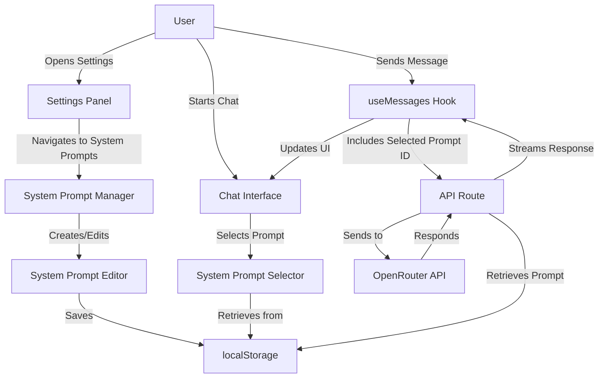

# System Prompt Management Design

This document outlines the design approach for implementing system prompt management in the chat application.

## Current Application Analysis

### How the Chat System Works
1. **Frontend Architecture**:
   - React-based Next.js application with client-side components
   - Uses a custom hook (`useMessages`) to manage chat messages
   - Messages are stored in localStorage for persistence
   - UI components are organized in a modular structure with reusable components

2. **Data Flow**:
   - User inputs messages in the textarea component
   - Messages are sent to the backend API route
   - The API route communicates with OpenRouter AI service
   - Responses are streamed back to the client
   - Messages are displayed in the chat interface

3. **Settings Management**:
   - User preferences (message density, font size) are managed through a settings panel
   - Settings are stored in localStorage
   - Settings are applied to the document through data attributes

### Current System Prompt Handling
- The system prompt is **hardcoded** in the API route (`route.ts`):
  ```typescript
  const system_prompt = "You are a helpful assistant.";
  ```
- This system prompt is added to the beginning of the messages array sent to the OpenRouter API
- There's currently no UI or settings for managing system prompts
- No persistence mechanism for custom system prompts

## Design Approach for System Prompt Management

### 1. Data Model for Storing System Prompts

I propose creating a data model that allows for:
- Multiple saved system prompts
- A default/active system prompt
- Metadata for each prompt (name, description, creation date)

```typescript
// New type definitions to add to chat.ts
export interface SystemPrompt {
  id: string;         // Unique identifier
  name: string;       // Display name
  content: string;    // The actual prompt text
  description?: string; // Optional description
  createdAt: Date;    // Creation timestamp
  updatedAt: Date;    // Last update timestamp
  isDefault?: boolean; // Whether this is the default prompt
}

// Updated RequestBody interface in route.ts
interface RequestBody {
  messages: OpenRouterMessage[];
  model?: string;
  systemPromptId?: string; // Optional ID to specify which system prompt to use
}
```

### 2. UI Components for System Prompt Management

We'll need to create the following new components:

1. **SystemPromptManager Component**:
   - A new tab or section in the settings panel
   - List of saved system prompts
   - Interface to create, edit, and delete prompts
   - Option to set a default prompt

2. **SystemPromptEditor Component**:
   - Form for creating/editing system prompts
   - Fields for name, content, and description
   - Preview functionality

3. **SystemPromptSelector Component**:
   - Dropdown or select component to choose the active system prompt for the current chat
   - Quick access to change the system prompt without opening settings

### 3. Backend Changes Required

1. **API Route Modifications**:
   - Update the chat API route to accept a system prompt ID
   - Retrieve the appropriate system prompt based on ID or use default
   - Apply the selected system prompt to the messages array

2. **Storage Implementation**:
   - Extend localStorage usage to store system prompts
   - Create utility functions for CRUD operations on system prompts

### 4. Integration with Existing Settings Interface

The system prompt management will be integrated with the existing settings panel:

1. **Add a new section to the settings panel**:
   ```jsx
   <div className="space-y-2">
     <h3 className="text-sm font-medium">System Prompts</h3>
     <SystemPromptManager />
   </div>
   ```

2. **Add a system prompt selector to the chat interface**:
   - Place it near the chat input or in the header area
   - Allow quick switching between prompts during a conversation

## Files to Modify

1. **`src/lib/types/chat.ts`**:
   - Add SystemPrompt interface
   - Update existing types as needed

2. **`src/app/api/chat/route.ts`**:
   - Modify to use dynamic system prompts instead of hardcoded one
   - Update request handling to accept systemPromptId

3. **`src/components/ui/settings-panel.tsx`**:
   - Add system prompt management section
   - Integrate with existing settings UI

4. **`src/lib/hooks/useMessages.ts`**:
   - Update to include system prompt selection in message handling
   - Modify sendMessage function to include selected system prompt ID

## New Files to Create

1. **`src/lib/hooks/useSystemPrompts.ts`**:
   ```typescript
   // Custom hook for managing system prompts
   export function useSystemPrompts() {
     // State and functions for CRUD operations on system prompts
     // Load/save from localStorage
     // Set active prompt
   }
   ```

2. **`src/components/settings/SystemPromptManager.tsx`**:
   ```typescript
   // Component for managing system prompts in settings
   const SystemPromptManager = () => {
     // List, create, edit, delete system prompts
     // Set default prompt
   }
   ```

3. **`src/components/settings/SystemPromptEditor.tsx`**:
   ```typescript
   // Component for editing a single system prompt
   const SystemPromptEditor = ({ prompt, onSave, onCancel }) => {
     // Form for editing prompt details
     // Preview functionality
   }
   ```

4. **`src/components/chat/SystemPromptSelector.tsx`**:
   ```typescript
   // Component for selecting active system prompt in chat
   const SystemPromptSelector = () => {
     // Dropdown to select active prompt
     // Quick access to prompt switching
   }
   ```

## Data Flow for System Prompt Management

1. **Creating/Editing System Prompts**:
   - User opens settings panel
   - Navigates to System Prompts section
   - Creates or edits a prompt using the SystemPromptEditor
   - Saves the prompt, which is stored in localStorage
   - Can set a prompt as default

2. **Using System Prompts in Chat**:
   - Default system prompt is loaded when chat initializes
   - User can select a different prompt using SystemPromptSelector
   - Selected prompt ID is included in API requests
   - API route applies the selected prompt to the messages

3. **Persistence**:
   - System prompts are stored in localStorage similar to messages and settings
   - Active/selected prompt ID is also stored in localStorage
   - When the app loads, it retrieves saved prompts and the active prompt ID

## Implementation Considerations

1. **Performance**:
   - System prompts should be loaded early to avoid UI jank
   - Consider memoization for prompt lists and selectors

2. **User Experience**:
   - Provide clear explanations of what system prompts are and how they affect the chat
   - Include sample/template prompts for users to start with
   - Allow importing/exporting prompts

3. **Error Handling**:
   - Handle cases where a selected prompt no longer exists
   - Provide fallback to default prompt when needed

4. **Future Extensibility**:
   - Design the system to potentially support prompt categories or tags
   - Consider how this might integrate with future features like conversation history or prompt sharing

## System Prompt Management Flow



## Default System Prompts

To provide a good starting point for users, we'll include these default system prompts:

1. **General Assistant**
   ```
   You are a helpful assistant. You provide clear, concise, and accurate information to the user's questions.
   ```

2. **Creative Writer**
   ```
   You are a creative writing assistant. You help users with storytelling, creative ideas, and writing techniques. Be imaginative and inspiring in your responses.
   ```

3. **Code Helper**
   ```
   You are a coding assistant. You help users with programming questions, debugging issues, and explaining technical concepts. Provide code examples when appropriate.
   ```